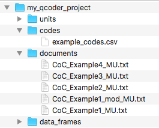
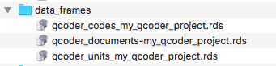
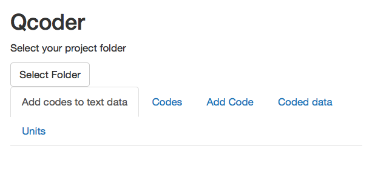
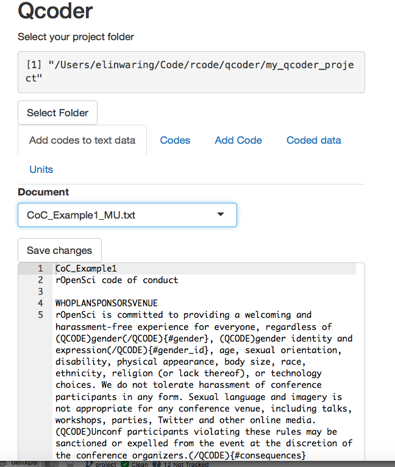
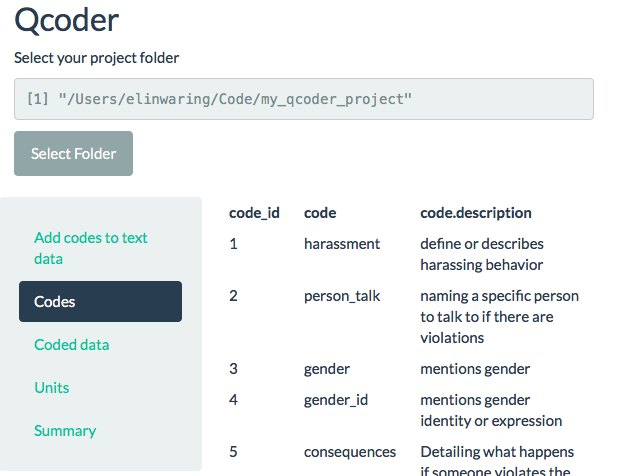
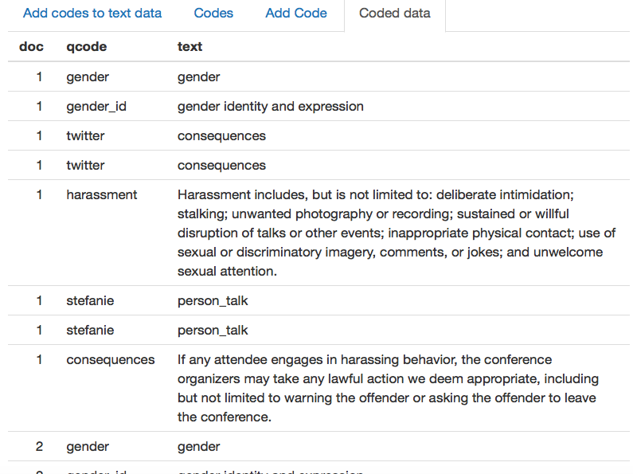

<!-- README.md is generated from README.Rmd. Please edit that file -->
QCoder
======

Lightweight package to conduct qualitative coding  

tl,dr
-----

To test with some sample data:

    install.packages("devtools")
    devtools::install_github("ropenscilabs/qcoder")
    library(qcoder)
    create_qcoder_project("my_qcoder_project", sample = TRUE)
    import_project_data(project = "my_qcoder_project")
    qcode()

Click "Select project folder" and "my qcoder project."  
There are two ways to add codes. To use an existing code, highlight the
text to be coded, select the code, click "Add selected code" and then
"Save changes." Text to be assigned a new (or existing) code should be
surrounded by (QCODER) (/QCODER) tags. The closing tag is followed
immediately by the code enclosed in curly brackets and prefixed with a
\# for example {\#samplecode}

Installation
------------

To install the latest development version, run

    install.packages("devtools")
    devtools::install_github("ropenscilabs/qcoder")
    library(qcoder)

Please note that this is not a release-ready version and should be
considered experimental and subject to changes. Still, we encourage you
to install and send us feedback on our issue tracker.

Motivation
----------

The motivation stems from the need for a free, open source option for
analyzing textual qualitative data. Textual qualitative data refers to
text from interview transcripts, observation notes, memos, jottings and
primary source/archival documents. A detailed discussion of the
motivation and other software can be found in our [motivation
document](https://github.com/ropenscilabs/qcoder/blob/master/motivation.Rmd).

Using QCoder
------------

QCoder is designed to be easy to use and to require minimal knowledge of
computer systems and code. Like all software, including other
applications for QDA there will be a learning period, but as we develop
Qcoder our goal will be to keep the interface simple and steadily
improve it. Currently we have a very minimal prototype.

Once you have installed QCoder, load it with the library command.

    library(qcoder)

This readme file is going to use sample data to illustrate basic QCoder
functionality. We will be using the simplest approach which is to use
the QCoder defaults for file names and folders. If you follow those same
patterns and conventions with your data you can use QCoder in the same
way. A full vignette will explain how to use non standard names and file
locations.

To begin we will create a QCoder project with sample data. (To create an
empty project leave out the sample option.)

    create_qcoder_project("my_qcoder_project", sample = TRUE)

This will create one main folder and four subfolders. Unless you
specified otherwise it will be in your current working directory (you
can find this with the `getwd()` command at the console). If you have a
specific location where you want to put the folder change your working
directory.

These will hold the documents to be coded, information about the codes,
unit information and the r data frames that will be the core of the
analysis. For this example the folder and file structures for the sample
data will look similar to this.

### Documents

In our example we've already placed our documents into the "documents"
folder. At this point we only have tested support for txt files. If you
have documents in other formats you can use "Save As" to convert to txt.
If you have doc, docx, html, pdf, rtf or some other formats these can be
processed if you install the `textreadr` package. For many users this
will simply require

    install.packages(textreadr)

However for other users, particularly those on linux systems, additional
steps are required. Please follow the [installation instructions for
pdftools](https://github.com/ropensci/pdftools).

### Codes

QCoder has the option to import a list of predefined codes from a CSV
file (if you have this in a spreadsheet you can "Save As" csv). This
file should have exactly 3 columns with headings:

-   code\_id (A unique number for each code)
-   code (One word description, can use underscores or hyphens)
-   code.description (Longer description of the code, must be enclosed
    in quotation marks.)

To use project defaults, this file should be called *codes.csv*. Here
are the contents of the sample data csv file that comes with QCoder.

     code_id,code,code.description
    1,"harassment","define or describes harassing behavior"
    2,"person_talk","naming a specific person to talk to if there are violations"
    3,"gender","mentions gender"
    4,"gender_id","mentions gender identity or expression"
    5,"consequences","Detailing what happens if someone violates the code of conduct"
    6,"license","The license for this code of conduct"

You are not restricted to using the listed codes in the csv file, but
this file allows you to produce a detailed codebook including
descriptions. (Creating a user interface for adding new codes is high
priority item on the project road map.)

### Units

Units represent the unit of analysis data are about. Often this is
individual people, but it may also be organizations, events or
locations. Units may be associated with multiple documents. In the
sample data a minimum units file is used, but additional columns can be
used to assign attribute data.

The default file name is units.csv; if stored in a spreadsheet this can
be created by using "Save As" csv.

(Treatment of units is a work in progress and subject to change.)

    Filename,unit_id,Name
    1,"rOpenSci"
    2,"LIBD Rstats Club"
    3,"Carpentries"
    4,"Rladies

A second file (and data frame once imported) connects units to
documents.  
Our framework allows each unit to be associated with multiple documents
and each document with multiple units. (Note that the sample data is
designed to allow you to add more unit-document links and hence does not
link each unit to a document.)

    doc_path,unit_id
    CoC_Example1_mod_MU.txt,1
    CoC_Example1_MU.txt,2
    CoC_Example3_MU.txt,3
    CoC_Example4_MU.txt,4

### Importing the data

To import this data into Qcode user the `import_project_data()`
function.

    import_project_data(project = "my_qcoder_project")

Now the data\_frames folder will contain the imported files.

Now it's time to start coding.

Coding uses a "Shiny App" to provide a user interface to the data. To
launch the app use the function `qcode()`.

    qcode()

Which will launch this application.

Coding
------

Once you have selected your project there will be a drop down menu on
the "Add codes to text" tab to allow you to pick a specific document to
code. This will pull a document into the editor.

Select your project folder.

Once you have a project, use the drop down menu to select a particular
document to code. This will open in an editor. When done coding
(instructions below), click Save changes.

Select your project folder.

Switching to the "Codes" tab a list of codes from the codes file is
displayed.

Our sample data already has some coding done, and the code-text data is
displayed on the "Coded data" tab.

### Coding the data

To add codes to the documents uses a tagging system. Text to be assigned
a code should be surrounded by (QCODER) (/QCODER) tags. The closing tag
is followed immediately by the code enclosed in curly brackets and
prefixed with a \# for example {\#samplecode}

(QCODE)This is the text that is being assigned a
code.(/QCODE){\#instructions}

One pair of {} can contain multiple codes, each with at \# and separated
by commas.

Alternatively, to use an existing code, highlight the text to be coded,
select the code or codes, click "Add selected code."

When you have finished coding a document press the "Save changes"
button.

### Cautions and known issues

Each time you save, Qcoder makes a backup copy of your documents data
frame. This is for safety and reproducability. This can end up with a
lot of files if you save often. You may want to periodically delete some
backups to save storage space.

Currently when you create a new code while coding, this code will be
displayed on the Coded data tab, but not on the Codes or Summary tabs.
You must restart the qcode application to update those displays. This is
a high priority development item.

### Road map

QCoder can be used right now for coding. However, we are not yet ready
for release.

Our immediate goal is to create a somewhat more advanced minimum viable
product. This includes creating user interfaces to add new documents,
codes and units and adding javascript support for inserting codes.

Contributors
------------

-   [Elin Waring](https://github.com/elinw)
-   [Dan Sholler](https://github.com/dsholler)
-   [Jenny Draper](https://github.com/learithe)
-   [Beth Duckles](https://github.com/bduckles)
